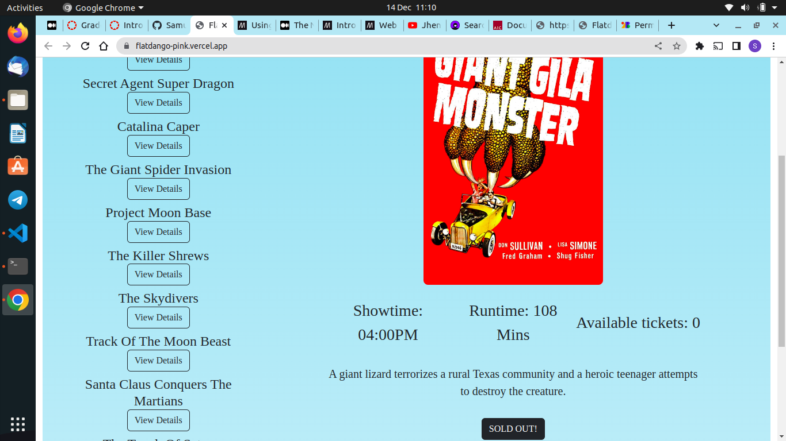

# Flatdango
Flatdango is a web application that allows people to buy theater movie tickets.

## Description
Flatdango web application allows its users to view the list of movies the theater is showing and the details of said movies. It enables a user to buy tickets of a movie that interests them.

## Technologies used
- HTML & CSS
- Bootstrap
- JavaScript
- Git and Github

## Get Started
To get started, you need the following:

### JSON Server
To install json-server on your computer, run the following command:

        npm install -g json-server

To run json-server on your local computer, run the command: 

        json-server --watch db.json

### Clone the repo
Clone the repository with:

        git clone git@github.com:Samueelx/flatdango.git

## Project Setup
To test out this web application you're going to need the following installed on your computer:

1. Visual Studion Code (Optional)
2. A web browser
3. Node.js - to install the json-server
4. Live Server Extension (Optional)

## Test the web application
To test the functionality of this web application, from this repo's root:

1. Run the json server using the command shown above.
2. Open the `index.html` file from your preferred browser.

### Alternatively
Click on the link in the `About` section of this repository.

## Screenshots
This is how the web application looks like: 

## Authors
Samuel Gitimu

## Licence
[MIT](https://github.com/Samueelx/flatdango/blob/master/LICENCE)